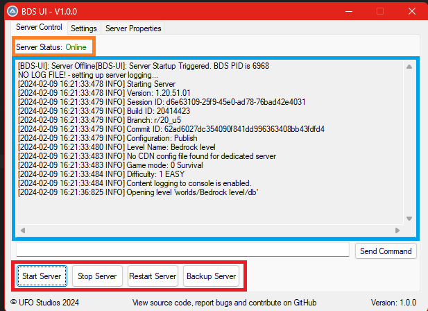
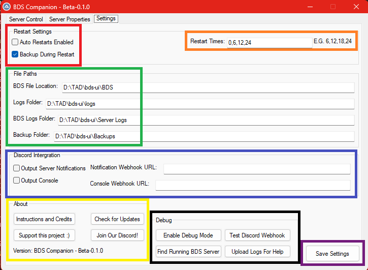

# BDS-Companion
A GUI and companion software for the Minecraft Bedrock Dedicated Server Software.

## Setup

Download the exe from the releases page, and move it to an empty folder. </br>
Extract a copy of MCBE's BDS to a folder named `BDS` within the folder the exe is in.</br>
Then double click the exe to open! 

Your folder should look like this:
``` plaintext
bds-companion/
    BDS-Companion.exe
    BDS/
        bedrock_server.exe
        server.properties
        (and other BDS files)
```
(The location of BDS can be changed in settings, but this is the default) </br>
You can find the latest release [here](https://www.minecraft.net/en-us/download/server/bedrock). Please note that this application only supports Windows.


## Features

### Server Management


- 🔴 Red: Main server control buttons
- 🟠 Orange: The server status. E.G: Online, Offline or Backing up.
- 🔵 Blue: Server Output. Anything with `[BDS-UI]` is info from bds-ui, the rest is BDS's own output.

### Settings
 

- 🔴 Red: The Backup & Restart Settings. Note: Backup won't work without restart also being enabled.
- 🟠 Orange: The time (in 24H) that BDS-UI will Restart/Backup. This is ignored if `Auto Restarts` is disabled
- 🟡 Yellow: The about tab, with (these) instructions, updates, discord & support the project link.
- 🟢 Green: The file paths. We recommend having them in the same folder (`D:/TAD/bds-ui` in the image, for example) for ease of use, but this is not needed
- 🔵 Blue: Discord Intergration. Allows BDS-Companion to send the console messages and the server status messages (Stop, start & ect) to discord. See [here](https://support.discord.com/hc/en-us/articles/228383668-Intro-to-Webhooks)
- ⚫ Black: The debug tab. Only use these if something is broken!
- 🟣 Purple: Save settings button. Make sure you save before leaving the tab!

## Troubleshooting

- ### <b>Q:</b> My PC says this is a virus! </br> 
    <b>A:</b> Yup, that's because not many people have downloaded this exe, so windows (amongst others) don't yet trust it. The code is open source on Github, and you're welcome to check it!
- ### <b>Q:</b> It can't find (BDS, server.properties, ect) </br>
    <b>A:</b> Check that the folder in settings matches the one with BDS in it, and restart BDS-UI. Please note it needs full (e.g `C:/BDS-Companion/BDS`) paths, not relative ones (e.g `./BDS`).
- ### <b>Q:</b> Where can I get help?</br>
     <b>A:</b> You can join our [Discord](https://thealiendoctor.com/r/Discord)! Make sure you have uploaded the logs using the `Upload Logs` button in the settings tab, and we'll be able to help you better!
- ### <b>Q:</b> Why does it open twice? </br>
     <b>A:</b> When auto-backing up, it'll open a seperate window to run the backup in (in case the backup window crashes). The window will close itself when the backup is done.


## Credits
- [TheAlienDoctor](https://thealiendoctor.com) & [Niceygy](https://niceygylive.xyz): Main Devs
- [RSBuilt](https://www.youtube.com/channel/UCsavfiVWuImW2ghluEoKXtg) and the whole Project Bedrock team, for letting us using their server for testing.
- [FoxyNoTail](https://foxynotail.com/): Originally inspired by [MCBEplay](https://foxynotail.com/tools/mcbe-play). Despite being recently open sourced, all code is original and his not been reused from his project.
- [Zip.au3](https://www.autoitscript.com/forum/topic/73425-zipau3-udf-in-pure-autoit/) UDF
- [WinHttp.au3](https://www.autoitscript.com/forum/topic/147621-http-get-and-post-request-as-simple-as-possible/) UDF
